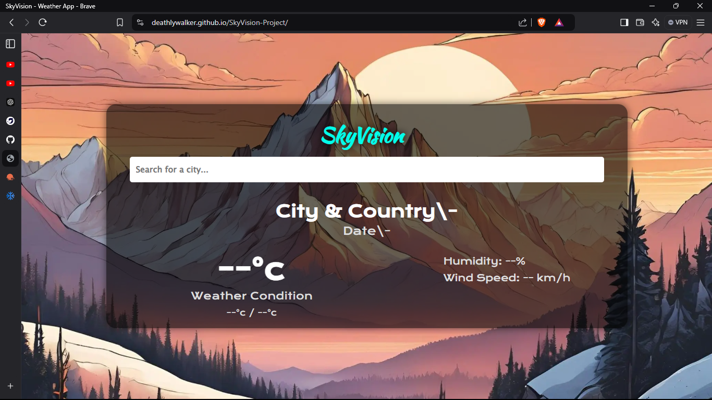
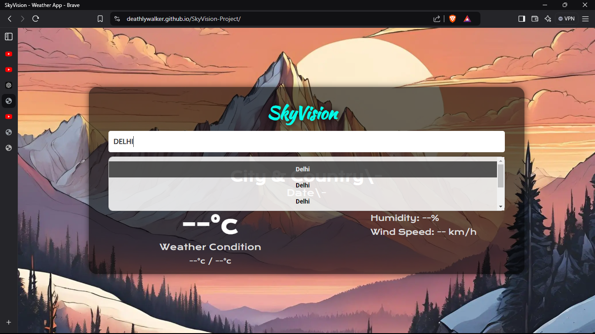
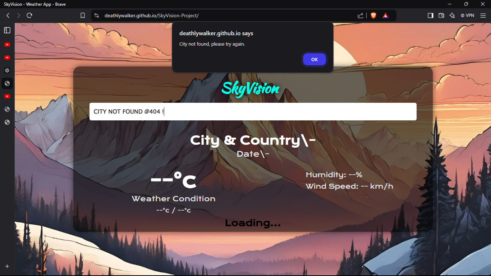
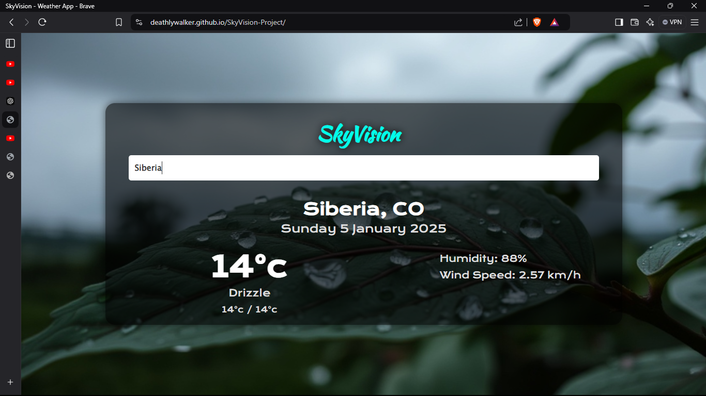
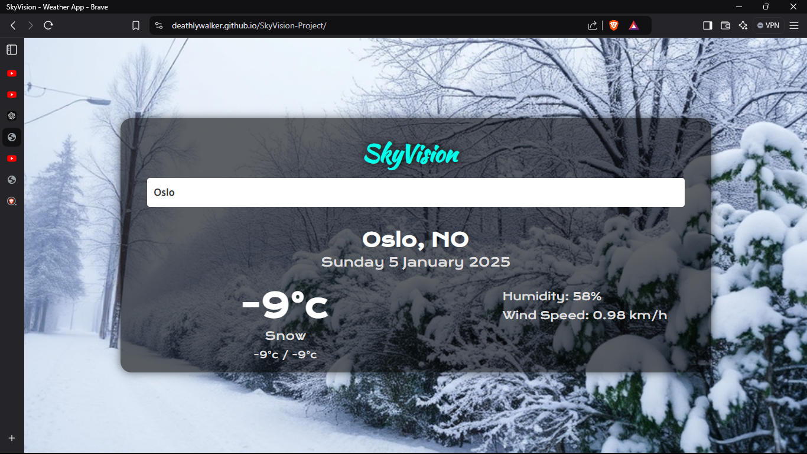
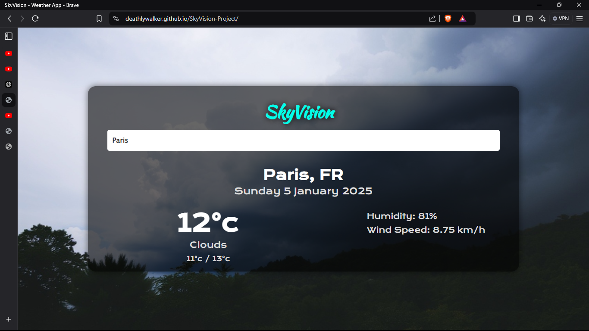

# SkyVision-ProjectSkyVision Weather Forecasting 🌦️
____________________________________________________
SkyVision is a simple and intuitive weather forecasting website that provides accurate and real-time weather data for locations around the world. It leverages powerful APIs to deliver detailed weather information including current temperature, humidity, forecasted highs and lows, and more!
-----------------------------------------------------
Key Features 🌟
Real-Time Weather Updates: Get the latest weather information for any city 🌍.
Accurate Forecast: View hourly and daily temperature predictions 📅.
Detailed Metrics: Includes current temperature, humidity, wind speed, and weather conditions 🌬️.
User-Friendly Interface: Clean and easy-to-navigate design for a smooth experience 🖥️.
Global Coverage: Supports weather data from cities all over the world 🌎.
-----------------------------------------------------------------------------
Tech Stack 💻
Frontend: HTML, CSS, JavaScript.
API: OpenWeatherMap.
Deployment: GitHub Pages.
-----------------
Screenshots 📸

____________________
LIVE SITE :
[SkyVision](https://deathlywalker.github.io/SkyVision-Project/)

